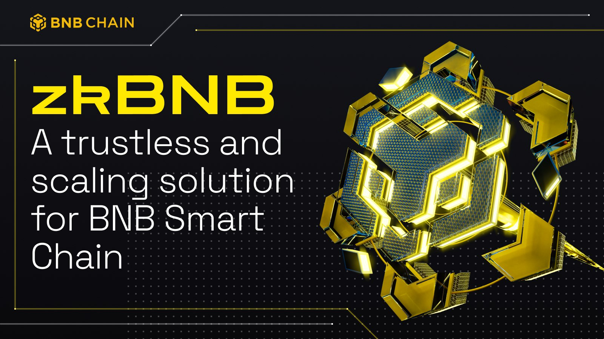

# 👨‍💻 Getting Started 

The zkBNB is an infrastructure for developers that helps them to build large-scale BSC-based apps with higher throughput and much lower or even zero transaction fees.

zkBNB is built on zk-Rollup architecture. zkBNB bundles (or "roll-up") hundreds of transactions off-chain and generates cryptographic proof. These proofs can come in the form of SNARKs (succinct non-interactive argument of knowledge) which can prove the validity of every single transaction in the Rollup Block.

zkBNB focuses on straightforward token operations and built-in marketplaces for Gaming and Social use cases. It serves as a scalability solution for the BNB Smart Chain by bundling multiple transactions into a single transaction, reducing costs for on-chain transactions. The Zero Knowledge proof system used in zkBNB ensures a much faster finality time of the L2 transactions, which helps improve the user experience. 

## 📔 Learn about zkBNB

Dive into what is zkBNB and start the journey with Greenfield.

- [An overview about zkBNB ](overview.md)
- [Get Started with detailed tutorials](../tutorials/fund-zkbnb-wallet.md)

## 👓 Explore zkBNB

Get familiar with the zkBNB and explore its main modules.

- [Explore core concepts of zkBNB](../core-concepts/overview.md)
- [An overview about Storage Layout](../storage/storage-layout.md)

## 👨‍🔧 Building Dapps on zkBNB

Start building dapps to create value based on the data assets and their related economy.
- Fund your zkBNB Wallet (_**Coming Soon**_⏰)
- Build a dapp with zkBNB API (_**Coming Soon**_⏰)

## 🙋‍♀️ Help & Support 
Check out the zkBNB Developer Discord for technical support. (**_TBA_** 📢)
